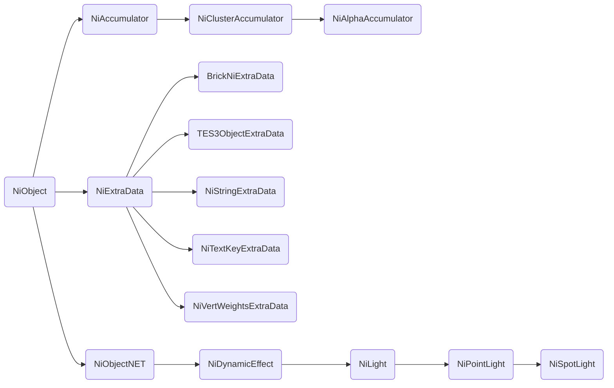

# NI Class Hiererchy

## niMain

### Basic Foundation Types
- niColor
- niColorA
- niPackedColor
- niRTTI

### Basic Math and Geometry Classes
- niBound - not exposed yet!!
- tes3boundingBox - not a NI Class
- tes3matrix33 - not a NI Class
- tes3vector2 - not a NI Class
- tes3vector3 - not a NI Class
- niQuaternion
- tes3transform - not a NI Class

### Templated Container Classes
- niTArray - not exposed as a type but can be iterated as a standard lua array
- niLinkedList
	- niDynamicEffectLinkedList
	- niNodeLinkedList
	- niPropertyLinkedList

### Animation Classes
- niRefObject
	- niObject
		- niTimeController

### Collision Classes
- niCollisionObject

### Texturing Classes
- niRefObject
	- niObject
		- niObjectNET
			- niTexture
				- niRenderedTexture - Not exposed
					- niRenderedCubeMap - We don't have this one
				- niSourceTexture
					- niSourceCubeMap - We don't have this one
		- niPalette - We don't have this one
		- niPixelData
		- niScreenTexture - We don't have this one

### Object Depth Sorting Classes
- niRefObject
	- niObject
		- niAccumulator - We don't have this one
			- niBackToFrontAccumulator/niClusterAccumulator (are the two the same?) - We don't have neither one
				- niAlphaAccumulator - We don't have this one
					- niTextureAccumulator - We don't have this one

### Geometry Data Classes
- niRefObject
	- niObject
		- niGeometryData
			- niLinesData - not exposed yet!!
			- niTriBasedGeomData
				- niParticlesData
					- niParticleMeshesData - We don't have this one
					- niAutoNormalParticlesData - We don't have this one
					- niRotatingParticlesData
				- niTriShapeData
					- NiScreenGeometryData - We don't have this one
					- niTriShapeDynamicData - We don't have this one
				- niTriStripsData - We don't have this one

### Geometry Rendering Classes
- niRefObject
	- niObject
		- niObjectNET
			- niAVObject
				- niGeometry - not exposed yet!!
					- niLines - not exposed yet!!
					- niTriBasedGeometry - not exposed yet!!
						- niTriShape
							- niScreenGeometry - We don't have this one
						- niTriStrips - We don't have this one
						- niParticles
							- niParticleMeshes - We don't have this one
							- niRotatingParticles
		- niScreenPolygon - not exposed yet!!
		- niSkinData
		- niSkinInstance

### Scene Graph Organization Classes
- niRefObject
	- niObject
		- niExtraData
			- niBinaryExtraData - We don't have this one
			- niBooleanExtraData - We don't have this one
			- niColorExtraData - We don't have this one
			- niFloatExtraData - We don't have this one
			- niFloatsExtraData - We don't have this one
			- niIntegerExtraData - We don't have this one
			- niIntegersExtraData - We don't have this one
			- niStringExtraData
			- niStringsExtraData - We don't have this one
			- niSwitchStringExtraData - We don't have this one
			- niTES3ExtraData
			- niTextKeyExtraData
			- niVectorExtraData - We don't have this one
		- niObjectNET
			- niAVObject
				- niNode
					- niBillboardNode
					- niBSPNode - We don't have this one
					- niCollisionSwitch
					- niSortAdjustNode - We don't have this one
					- niSwitchNode
						- niLODNode - We don't have this one
- niTextKey - animation class

### Lightning and Effects Classes
- niRefObject
	- niObject
		- niObjectNET
			- niAVObject
				- niDynamicEffect
			    	- niLight
				    	- niAmbientLight
						- niDirectionalLight
						- niPointLight
							- niSpotLight
					- niTextureEffect

### Rendering and Property Classes
- niRefObject
	- niObject
		- niObjectNET
			- niAVObject
				- niCamera
					- niScreenSpaceCamera - We don't have this one
			- niProperty
				- niAlphaProperty
				- niDitherProperty - We don't have this one
				- niFogProperty
				- niMaterialProperty
				- niRendererSpecificProperty - We don't have this one
				- niShadeProperty - We don't have this one
				- niSpecularProperty - We don't have this one
				- niStencilProperty
				- niTexturingProperty
				- niVertexColorProperty
				- niWireframeProperty - We don't have this one (yet)
				- niZBufferProperty
		- niRenderer - no exposed yet
	- niPropertyState

## niOldParticle

### Particle System Classes
- niRefObject
	- niObject
		- niEmitterModifier - Wo don't have this one
		- niParticleModifier
			- niGravity
			- niParticleBomb
			- niParticleCollider
				- niPlanarCollider
				- niSphericalCollider
			- niParticleColorModifier
			- niParticleGrowFade
			- niParticleMeshModifier
			- niParticleRotation
		- niTimeController - Not only related to particles
			- niParticleSystemController
- niPerParticleData

## niCollision

### Collision Classes
- niCollisionGroup
- niCollisionGroupRecord
- niRefObject
	- niObject
		- niObjectNET
			- niAVObject
				- niNode
					- niCollisionSwitch
- niPick

## niAnimation

### Animation Classes
- niRefObject - TODO REMOVE
	- niActorManager - We don't have this one
	- niKGMTool - We don't have this one
	- niObject
		- niColorData
		- niControllerSequence - We don't have this one
		- niExtraData - Not related to animation
			- niTextKeyExtraData
		- niKeyframeData
		- niMorphData - We don't have this one yet
		- niPosData - Not exposed yet
		- niSequence - not exposed yet
		- niTimeController -- TODO Document all of the subtypes
			- niControllerManager - We don't have this one
			- niFlipController - Not exposed yet
			- niFloatController - We don't have this one
				- niAlphaController - We don't have this one yet
				- niRollController - We don't have this one
			- niKeyframeController
			- niKeyframeManager - Not exposed yet
			- niLightColorController - We don't have this one
			- niLookAtController
			- niMaterialColorController - We don't have this one yet
			- niMorpherController - We don't have this one
				- niGeomMorpherController - We don't have this one
			- niParticleSystemController
				- niBSPArrayController - We don't have this one yet
			- niPathController - We don't have this one yet
			- niTextureTransformController - We don't have this one
			- niUVController - Not exposed yet
			- niVisController - We don't have this one yet
		- niUVData - not exposed yet
		- niVisData - we don't have this one yet
- niAnimationKey
	- niColorKey
	- niFloatKey
		- niBezFloatKey
		- niTCBFloatKey
	- niPosKey
		- niBezPosKey
		- niTCBPosKey
	- niRotKey
		- niBezRotKey
		- niTCBRotKey
		- niEulerRotKey
- niTextKey
- niVisKey - We don't have this one

