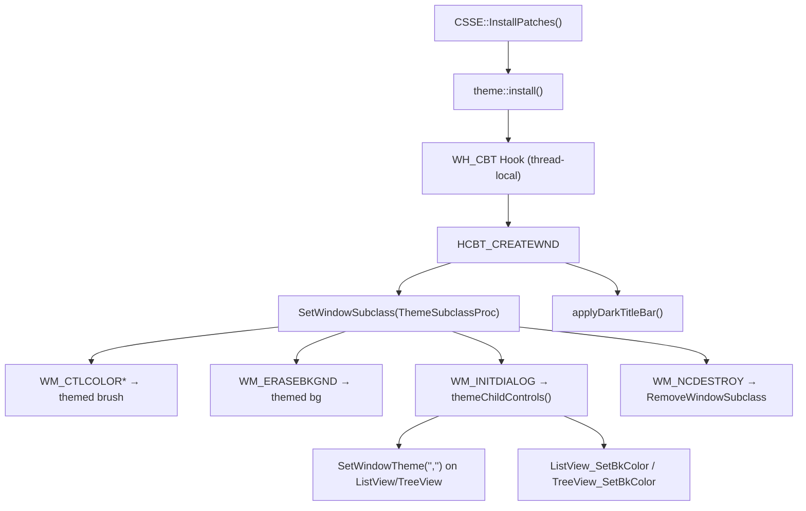

# CSSE Theme Engine — Phase 1 Implementation Summary

## What Was Built (Phase 1: Core Infrastructure + Quick Visual Wins)

The full Phase 1 from the plan has been implemented and **builds clean** (`CSSE.dll` produced).

### New Files Created

| File | Purpose |
|------|---------|
| [ThemeEngine.h](file:///c:/Users/Admin/Projects/MWSE/CSSE/ThemeEngine.h) | Public API: `theme::isEnabled()`, `theme::getCachedBrush()`, `theme::install()`, `theme::shutdown()` |
| [ThemeEngine.cpp](file:///c:/Users/Admin/Projects/MWSE/CSSE/ThemeEngine.cpp) | CBT hook + subclass proc + brush cache + DWM dark title bar + UxTheme control stripping |

### Files Modified

| File | Changes |
|------|---------|
| [Settings.h](file:///c:/Users/Admin/Projects/MWSE/CSSE/Settings.h) | Expanded `ColorTheme` with 22 semantic palette colors, packed COLORREF cache, `applyPreset()`, `enabled`/`preset`/`use_dark_title_bar` toggles |
| [Settings.cpp](file:///c:/Users/Admin/Projects/MWSE/CSSE/Settings.cpp) | `applyPreset("dark")` with curated dark colors, expanded `from_toml`/`into_toml`/`packColors` for all new fields |
| [CSSE.cpp](file:///c:/Users/Admin/Projects/MWSE/CSSE/CSSE.cpp) | `theme::install()` in `InstallPatches()`, `theme::shutdown()` in `ExitInstance()` |
| [DialogLayersWindow.cpp](file:///c:/Users/Admin/Projects/MWSE/CSSE/DialogLayersWindow.cpp) | Theme-aware owner-draw (selection/bg colors), themed window class background |
| [DialogObjectWindow.cpp](file:///c:/Users/Admin/Projects/MWSE/CSSE/DialogObjectWindow.cpp) | Themed fallback colors for non-highlighted NM_CUSTOMDRAW rows |
| [DialogCellWindow.cpp](file:///c:/Users/Admin/Projects/MWSE/CSSE/DialogCellWindow.cpp) | Themed fallback colors for non-highlighted NM_CUSTOMDRAW rows |
| [CSSE.vcxproj](file:///c:/Users/Admin/Projects/MWSE/CSSE/CSSE.vcxproj) | Added `ThemeEngine.cpp`/`.h`, linked `dwmapi.lib` + `uxtheme.lib` |
| [CSSE.vcxproj.filters](file:///c:/Users/Admin/Projects/MWSE/CSSE/CSSE.vcxproj.filters) | Added filter entries for Solution Explorer |

## Architecture



## How to Enable

Add to `csse.toml`:

```toml
[color_theme]
enabled = true
preset = "dark"
```

Individual colors can be overridden:

```toml
[color_theme]
enabled = true
preset = "dark"
window_bg = [35, 35, 40]     # slightly different dark bg
edit_bg = [50, 50, 55]        # lighter edit fields
```

## What Phase 1 Covers (~80% of UI)

- ✅ Dialog backgrounds (WM_ERASEBKGND)
- ✅ Text/edit controls (WM_CTLCOLOREDIT)
- ✅ Static labels (WM_CTLCOLORSTATIC)
- ✅ List boxes (WM_CTLCOLORLISTBOX)
- ✅ Button backgrounds (WM_CTLCOLORBTN — partial, face not controlled)
- ✅ ListView/TreeView bg+text colors
- ✅ Dark title bars (DwmSetWindowAttribute)
- ✅ Row highlight colors adapted for dark mode
- ✅ Layers window owner-draw
- ✅ Render viewport excluded from painting

## Remaining Phases

### Phase 2 (not yet implemented)
- ListView header NM_CUSTOMDRAW
- Tab control owner-draw
- ComboBox dropdown theming
- Button owner-draw for full control
- MFC property grid theming

### Phase 3 (not yet implemented)
- Owner-drawn menus
- Toolbar theming
- StatusBar owner-draw
- Script editor (RichEdit) dark bg
- Theme selector in settings UI
- Hot-reload support
